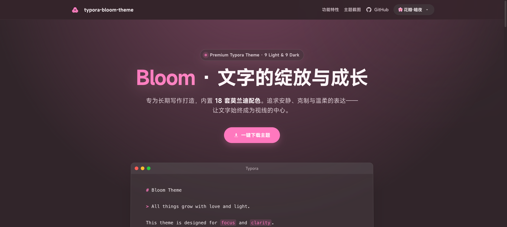

# Bloom for Typora

<p align="center">
  
</p>

<p align="center">
  
  
  
  
  <a href="README.en.md"></a>
</p>

<p align="center">
  为长期写作准备的 Typora 主题。
  <br />
  更安静的页面，更稳定的层级，更统一的代码与文档视觉。
</p>

<p align="center">
  <a href="https://typora-bloom-theme.webkubor.online"><strong>预览官网</strong></a> ·
  <a href="https://typora-bloom-theme.webkubor.online/showcase.html"><strong>在线演示</strong></a> ·
  <a href="https://github.com/webkubor/typora-Bloom-theme/releases/latest"><strong>下载最新版本</strong></a>
</p>

## Bloom 是什么

Bloom 是一套面向长文写作的 Typora 主题集合，围绕三个核心目标打磨：

- 让正文更耐看，减少连续写作时的视觉疲劳。
- 让代码块、引用、表格、YAML Frontmatter 等高频模块风格统一。
- 让浅色和深色主题切换时，亮度与层次依然稳定。

当前版本为 `v1.3.4`。

## 为什么用 Bloom

| 特性 | 说明 |
| :-- | :-- |
| 16 套主题矩阵 | 8 套浅色和 8 套深色主题，覆盖温润、克制、自然、夜间等写作场景。 |
| OKLCH 调色 | 采用更接近人眼感知的色彩空间，减少主题切换时的亮度跳变。 |
| 统一模块语言 | 代码块、HTML Block、YAML Frontmatter、Alert 等模块共享同一套层级与圆角逻辑。 |
| 为 Typora 优化 | 针对 Markdown 编辑、预览阅读和深色模式对比度做过专门调整。 |

## 主题一览

| 浅色主题 | 深色主题 |
| :-- | :-- |
| `petal` 花瓣 | `petal-dark` 花瓣·暗夜 |
| `mist` 雾蓝 | `mist-dark` 雾蓝·暗夜 |
| `verdant` 草木 | `verdant-dark` 草木·暗夜 |
| `stone` 暖石 | `stone-dark` 暖石·暗夜 |
| `ripple` 涟漪 | `ripple-dark` 涟漪·暗夜 |
| `cinnabar` 丹红 | `cinnabar-dark` 丹红·暗夜 |
| `sage` 鼠尾草 | `sage-dark` 鼠尾草·暗夜 |
| `spring` 紫语 | `spring-dark` 紫语·暗夜 |

## 快速安装

1. 在 [Releases](https://github.com/webkubor/typora-Bloom-theme/releases/latest) 下载 `Bloom-theme.zip`。
2. 在 Typora 中打开 `偏好设置 -> 外观 -> 打开主题文件夹`。
3. 将压缩包中的所有 `bloom-*.css` 文件和 `bloom/` 文件夹复制到主题目录。
4. 重启 Typora，或从 `主题` 菜单切换到 Bloom。

## 本次版本更新

`v1.3.4` 主要包括：

- 统一代码块、 HTML Block、YAML Frontmatter 的视觉语言。
- 增加对原生 GitHub Alert 语法的样式支持。
- 修复深色主题下 Mermaid 可读性和局部对比度问题。

<details>
<summary>开发与构建</summary>

### 本地开发

```bash
pnpm install
npm run dev
```

### 常用命令

- `npm run build`: 重新生成 `dist/` 主题文件和站点主题数据。
- `npm run package`: 生成发布包 `Bloom-theme.zip`。
- `npm run release`: 执行打包、提交、推送和打 Tag 的发布流程。

### 仓库结构

- `theme-src/`: 主题源码，包含基础样式和各主题变量。
- `dist/`: 构建产物，Typora 实际使用的 CSS 文件。
- `bloom/`: 字体等静态资源。
- `scripts/`: 构建、打包、发布和站点数据脚本。
- `website/`、`_pages/`: 展示站资源。
- `demo/`: 预览辅助资源。

</details>

## License

[MIT](LICENSE)

## Author

[webkubor](https://github.com/webkubor)
